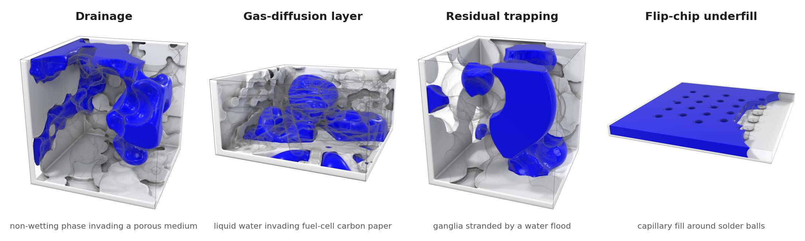
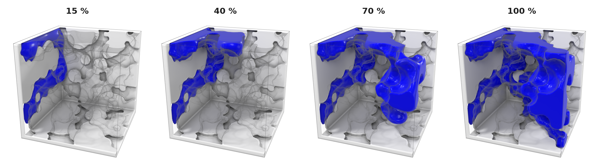

# bob

**A GPU-accelerated two-phase lattice-Boltzmann solver in JAX for multiphase flow in porous media.**

bob implements the color-gradient lattice-Boltzmann method on the D3Q19 lattice. It simulates
immiscible two-phase displacement — drainage, imbibition, trapping, capillary filling — directly
on voxelized 3D geometries such as micro-CT images of rock, fibrous gas-diffusion layers and
electronic packages. The solver is written as pure, jit-compiled JAX functions, runs unchanged
on CPU, on a single GPU, or sharded across the GPUs of a node, and is validated against
analytic laws and published experiments.

<p align="center">
  
</p>

*One frame from each production campaign. Blue is the invading fluid; the solid is cut open
toward the camera.*

## Features

- **Two-phase color-gradient model** on D3Q19 with multiple-relaxation-time (MRT) collision,
  continuum-surface-force (CSF) surface tension, and recoloring for a sharp, mass-conserving
  interface. Viscosity ratios from 0.01 to 30 are exercised in the validation suite.
- **Geometric wetting boundary condition** on arbitrary voxel walls: the contact angle is
  prescribed directly in degrees (closed-form reorientation of Akai *et al.* 2018, or the
  secant form of Leclaire *et al.* 2017). Realized sessile-drop angles follow the prescribed
  angle to within about 4° over 30–150°.
- **Boundary conditions for displacement experiments:** per-color Zou–He pressure inlets and
  outlets, a rate-controlled piston inlet with an exact injected-volume ledger, and
  half-way bounce-back walls.
- **Multi-GPU** domain decomposition with thin per-stage halo exchange。
- **Composable by construction:** every solver stage is a pure `state -> state` function that
  works under `jax.jit`, `jax.lax.scan` and `shard_map`.
- **Reproducible runs:** HDF5 field output, checkpoint/resume, incremental metrics, and a
  `run_meta.json` sidecar recording all parameters, precision, code version, geometry hash,
  devices and device-hours.
- **Validated:** a test suite (`test/`) and a set of physics demos (`demo/`), each with an
  explicit pass criterion.

## Installation

bob uses [uv](https://docs.astral.sh/uv/) and requires Python ≥ 3.10.

```bash
git clone https://github.com/PoreML/bob.git
cd bob
uv sync                  # CPU
uv sync --extra cuda     # Linux + NVIDIA GPU (CUDA 12)
```

With the CUDA extra installed, JAX uses an available GPU automatically and falls back to CPU
otherwise; `uv run python -c "import bob, jax; print(jax.devices())"` shows which device is in
use. bob allocates GPU memory on demand (it disables JAX's default preallocation, overridable
through `XLA_PYTHON_CLIENT_PREALLOCATE`), so it coexists with other jobs on a shared GPU.
`scripts/gpu-run.sh <command>` runs a command with the environment's bundled CUDA libraries
placed ahead of a system CUDA installation.

## Quick start

Drainage of a square duct: the non-wetting (red) phase is injected at a fixed rate and
displaces the wetting (blue) phase.

```python
import jax
import jax.numpy as jnp

from bob import color3d, porous3d

# Geometry: a square duct along x. Mask convention: True = solid, False = pore.
nz, ny, nx = 24, 24, 96
solid = porous3d.duct(nz, ny, nx)
nw = color3d.wall_normals(solid)            # wall normals for the wetting BC (once per geometry)

# Fluids: equal viscosity nu = 1/6 (omega = 1), sigma = 0.05, red contact angle 135 deg (non-wetting)
params = color3d.Params(omega=1.0, sigma=0.05, beta=0.99, theta=135.0)

# Drainage: red displaces blue, injected by a rate-controlled piston inlet
state = porous3d.init_drainage(nz, ny, nx, n_red=8)
run = jax.jit(lambda s: porous3d.drain(s, params, jnp.asarray(solid), n_in=8, u_in=2e-3,
                                       steps=1000, nw=nw, inlet="piston", outlet_sa_red=0.0))
for block in range(5):
    state = run(state)
    print(f"step {1000 * (block + 1):5d}  red saturation = {porous3d.saturation(state, solid):.3f}")
```

The saturation grows by 0.021 per block — exactly the injected volume, `u_in` × 1000 steps over
a 96-cell duct. Replace `porous3d.duct(...)` by `porous3d.load_structure("rock.npy")` to run on
a voxel image.

## Conventions

| | |
|---|---|
| Solid mask | `True` = solid, `False` = pore |
| Array layout | populations `(19, nz, ny, nx)`; velocity `(3, nz, ny, nx)` ordered `(ux, uy, uz)`; spatial axes `(z, y, x)` |
| Flow axis | x (inlet at `x = 0`, outlet at `x = -1`) |
| Phases | *red* and *blue*; `Params.theta` is the contact angle of the red phase in degrees |
| Units | lattice units (Δx = Δt = 1, reference density 1); kinematic viscosity ν = (1/ω − 1/2)/3 |
| Precision | float32 by default — the method is memory-bandwidth bound, so fp32 gives about twice the throughput at matching physics. `BOB_FP64=1`, or enabling `jax_enable_x64` before importing `bob`, selects float64; `BOB_FP32=1` forces float32. Precision is fixed when `bob` is imported. |

## Solver

The default configuration of `color3d.Params` is the validated stack:

| component | default | alternative |
|---|---|---|
| Collision | MRT (`mrt=True`); `mrt_chi=0.8` ties the non-hydrodynamic rates to the viscosity and stabilizes large viscosity ratios | BGK (`mrt=False`) |
| Surface tension | continuum surface force, **F** = ½ σ κ ∇φ (`csf=True`) | Reis–Phillips perturbation operator |
| Recoloring | Latva-Kokko–Rothman form with the lattice-speed factor (`recolor_emag=True`), sharpness `beta` | classic form |
| Wetting | geometric contact-angle condition, `wetting="akai"`; enabled by `theta` plus the precomputed `wall_normals` | `wetting="leclaire"`; neutral walls without `theta` |
| Walls | half-way bounce-back (`halfway=True`) | full-way bounce-back |
| Color gradient | isotropic discrete gradient of order (2, 4) | higher orders through `bob.hograd` |

| module | contents |
|---|---|
| `bob.d3q19` | lattice constants |
| `bob.lbm3d` | single-phase core: equilibrium, collision, streaming, bounce-back |
| `bob.mrt` | moment basis and relaxation-rate spectra |
| `bob.color3d` | two-phase solver: `State`, `Params`, `step` and its individual stages |
| `bob.bc` | inlet and outlet boundary conditions |
| `bob.porous3d` | geometry loading and cropping, drainage/imbibition drivers, saturation, breakthrough, front and pressure diagnostics |
| `bob.hograd` | high-order isotropic gradient stencils |
| `bob.multigpu` | device meshes, sharding, halo-exchange step functions |
| `bob.utils` | field and metadata I/O (`file`), run monitoring and checkpoints (`stats`), plotting (`viz`), PyVista 3D rendering (`viz3d`) |

## Multi-GPU

`bob.multigpu` decomposes the domain into slabs along z. The default backend,
`staged_halo_step`, runs the step under `shard_map` and exchanges thin ghost-plane halos per
stage — the phase field at depth 4 before collision and the populations at depth 1 before
streaming — so collision never runs on ghost planes. The sharded step reproduces the
single-device result to round-off. Build the step function from the unsharded host arrays,
then shard the state:

```python
from bob import multigpu

mesh = multigpu.mesh(8)
step_fn = multigpu.staged_halo_step(mesh, params, solid, nw=nw)
state = multigpu.shard(state, mesh)
state = porous3d.drain(state, params, solid, n_in, u_in, steps, nw=nw, inlet="piston", step_fn=step_fn)
```

Plain GSPMD sharding (`multigpu.shard` alone) needs no further wiring and also supports
sharding along y or x. `demo/multi_gpu_halo` documents the mechanism and the scaling
measurements; `demo/multi_gpu_parity` verifies that decomposition leaves the physics unchanged.

## Validation demos

Each folder in `demo/` holds a driver script, a README with setup, pass criterion and results,
and — where a figure is published — a `publication_plot.py` that replots the saved results.
Run any of them from the repository root with `uv run python demo/<name>/<script>.py`;
generated artifacts are written to the demo's `output*/` folder.

A run writes its data — `metrics.csv`, `run_meta.json`, `report.md`, HDF5 fields,
checkpoints — together with its field renders and GIFs. The analysis curves (capillary
pressure, saturation, ledger and fit plots) are **opt-in**: pass `--plots` to a driver, or
set `BOB_PLOTS=1` for a whole session. The `publication_plot.py` tools are separate: they
replot the frozen CSV results of a finished run into the paper figures whenever invoked.

| demo | validates | reference |
|---|---|---|
| `laplace` | surface tension: droplet rounding, sessile drop, Δp = 2σ/R | Young–Laplace law |
| `layered_poiseuille` | viscosity contrast, M = 5–30, pressure-driven layered flow | analytic velocity profile |
| `wetting` | prescribed vs realized contact angle, 30–150° | sessile-drop geometry |
| `droplet_on_sphere` | wetting on a curved solid surface | Akai *et al.* (2018) |
| `washburn` | capillary imbibition dynamics in a tube, six contact angles | two-fluid Washburn law; Sedahmed & Coelho (2024) |
| `capillary_pressure` | entry pressure of circular, square and rectangular tubes | Young–Laplace, Princen, Mason & Morrow (1991) |
| `capillary_fill` | pore-filling order in single-junction micro-models, imbibition and drainage | Zacharoudiou *et al.* (2017) |
| `lenormand` | stable displacement, viscous fingering and capillary fingering in a 256³ sphere pack | Lenormand *et al.* (1988) |
| `imbibition` | capillary-dominated imbibition in sphere packs of three sizes | — |
| `resolution` | sensitivity of drainage to grid resolution | — |
| `scal` | capillary-pressure hysteresis loop on Bentheimer sandstone with a porous plate | special core analysis protocol |
| `underfill_mt` | capillary underfill of a flip-chip package | Wang *et al.* (2016) |
| `multi_gpu_parity`, `multi_gpu_scaling`, `multi_gpu_halo` | correctness and strong scaling of the multi-GPU backends | single-device result |

## Production campaigns

`case/` contains the campaigns that generate large simulation datasets: primary drainage in
rock and sphere-pack geometries (`case/drainage`), drainage in fuel-cell gas-diffusion layers
(`case/GDL`), residual trapping under water flooding (`case/trapping`) and capillary underfill
of flip-chip packages (`case/underfill`). A campaign is a frozen, seeded draw of geometries and
fluid parameters (`campaign_draw.py`), submitted as SLURM job arrays from immutable manifests
(`submit_phase.py`); every run is resumable and writes its own `run_meta.json`. The rock, GDL
and package geometries are external datasets; see `case/README.md` for their layout and for the
campaign protocol.

<p align="center">
  
</p>

*A drainage run in a polydisperse sphere pack (128³, M = 0.2, θ = 140°) at 15, 40, 70 and
100 % of its duration: the non-wetting phase enters from the inlet face and advances pore by
pore.*


## Tests and code style

```bash
uv run pytest -q                          # full suite, about 4 minutes on a GPU
uv run pytest test/test_wetting_bc.py -v  # one feature
uv run ruff check src test demo case      # lint (ruff is pinned in the dev dependencies)
```

The tests run in float64 and cover the single-phase core, the two-phase solver, MRT, wetting,
boundary conditions, porous drainage, field I/O, run metadata, multi-device parity and the
campaign machinery. The geometries they use are in `test/assets/`.

## Repository layout

```
src/bob/    solver package
test/       test suite and geometry assets
demo/       validation demos and benchmarks
case/       production dataset campaigns
scripts/    helper scripts
```

## Citing

If you use bob in academic work, please cite this repository:
<https://github.com/PoreML/bob>.

## References

- T. Akai, B. Bijeljic, M. J. Blunt, "Wetting boundary condition for the color-gradient lattice
  Boltzmann method: validation with analytical and experimental data", *Adv. Water Resour.*
  **116**, 56–66 (2018).
- M. Latva-Kokko, D. H. Rothman, "Diffusion properties of gradient-based lattice Boltzmann
  models of immiscible fluids", *Phys. Rev. E* **71**, 056702 (2005).
- S. Leclaire, A. Parmigiani, O. Malaspinas, B. Chopard, J. Latt, "Generalized three-dimensional
  lattice Boltzmann color-gradient method for immiscible two-phase pore-scale imbibition and
  drainage in porous media", *Phys. Rev. E* **95**, 033306 (2017).
- R. Lenormand, E. Touboul, C. Zarcone, "Numerical models and experiments on immiscible
  displacements in porous media", *J. Fluid Mech.* **189**, 165–187 (1988).
- T. Reis, T. N. Phillips, "Lattice Boltzmann model for simulating immiscible two-phase flows",
  *J. Phys. A: Math. Theor.* **40**, 4033–4053 (2007).
- M. Sedahmed, R. C. V. Coelho, "Wetting and pressure gradient performance in a lattice
  Boltzmann color gradient model", *Phys. Fluids* **36**, 092117 (2024).
- I. Zacharoudiou, E. M. Chapman, E. S. Boek, J. P. Crawshaw, "Pore-filling events in single
  junction micro-models with corresponding lattice Boltzmann simulations", *J. Fluid Mech.*
  **824**, 550–573 (2017).
- Q. Zou, X. He, "On pressure and velocity boundary conditions for the lattice Boltzmann BGK
  model", *Phys. Fluids* **9**, 1591–1598 (1997).
